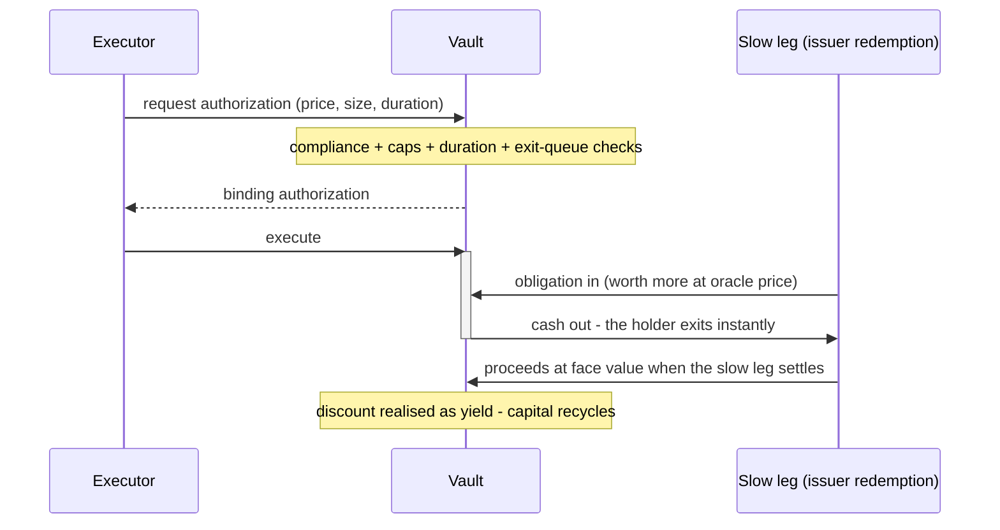

<Note>
  **Coming soon.** Instant Redemption is in design, not yet live. This page describes the planned product so issuers, capital providers, and market makers can evaluate it early - specifics such as parameters, contract addresses, and audits publish at launch, and unresolved economics are marked as such rather than guessed.
</Note>

## The Settlement-Time Gap

A token burns in seconds; the value behind it often doesn't. Underlyings liquidate on T+1 cycles or worse - redemption windows, withdrawal queues, out-of-hours cutoffs - so "instant redemption" promises break precisely when they're tested. Today every product spanning that gap patches it privately: idle buffers, solver balance sheets, perpetual incentive spend.

Instant Redemption is the [Shared Collateral Network](/collateral)'s founding product for that gap: a standing, market-priced bid from shared committed capital, so the issuer runs **fully invested** - no buffer, no incentive spend - while holders leave in seconds. And because the bid draws on one pooled network rather than a reserve per product, it is deeper than any single buffer could be, and it stands on off days and when the primary market is closed. It is also rung one of what makes an asset collateral-grade on the network: an asset that can be exchanged now can be liquidated now, and only then can it back anything else.

## How the Exit Works

A [programmable vault](/collateral/vaults) fronts the fast leg of the exit - the instant redemption, the off-hours stablecoin conversion - and recycles its capital when the slow leg completes.

### An Exchange, Not a Loan

Most instant-liquidity designs lend capital and hope repayment arrives. A [vault](/collateral/vaults) on the Shared Collateral Network never does: in this product its cash leaves **only inside a transaction where an obligation valued higher at oracle price arrives in exchange** - a tokenised asset already queued for redemption, an issuer redemption claim.

That inversion carries the whole risk story. The vault's net asset value doesn't dip when capital deploys - one asset (cash) is swapped for another (an obligation bought at a discount). When the obligation matures at face value, the discount is realised as depositor yield. Fronting a multi-day redemption means *holding that obligation to maturity* - not trusting a borrower.

### The Flow

<Steps>
  <Step title="A settlement gap appears">
    A holder wants out of a tokenised asset mid-queue, or a stablecoin needs converting while the issuer's banking rails are shut.
  </Step>

  <Step title="An executor quotes the wait">
    A market maker or solver prices the duration - how long until the slow leg completes - and requests a binding authorization from the vault. Every gate fires here: compliance policy, per-executor caps, duration limits, and the exit queue's seniority.
  </Step>

  <Step title="The vault exchanges, atomically">
    In one transaction the obligation transfers into the vault and cash goes out at the authorized, oracle-bounded price. The vault itself performs the exchange - the executor only instructs it, and at no point holds vault capital.
  </Step>

  <Step title="The slow leg completes, capital recycles">
    The issuer's redemption pays out - proceeds land in the vault at face value, the obligation retires, and the capital is immediately available for the next draw. Recycling is what makes a modest vault serve deep flow.
  </Step>
</Steps>

### Why Zero-Collateral Is Safe Here

No executor posts collateral, yet depositors are not extending unsecured credit. The protections stack:

1. **Obligation before liquidity.** There is no moment where cash is out and the obligation is not in - the exchange is one transaction or it doesn't happen.
2. **The vault executes.** Executors instruct draws but never custody capital; no code path hands vault cash to an executor's address.
3. **Oracle-bounded pricing.** Every purchase clears at or below oracle value minus a curator-set minimum discount - the vault can overpay only if the oracle itself is wrong, and concentration caps bound even that.
4. **Withdrawals outrank draws.** Cash already promised to the exit queue can never be consumed by a new purchase.
5. **Duration caps match exit windows.** No obligation may outlive the vault's withdrawal delay, so exiting depositors and maturing obligations never race each other.
6. **Losses are shared instantly.** If an obligation ever impairs, the markdown hits all shares pro-rata the moment it's recognised - no first-out advantage, no reason to run.
7. **Everyone is gated.** Curators, depositors, and executors pass KYB, sanctions, and jurisdiction checks per the vault's policy - and every draw re-checks it.
8. **Caps and circuit breakers.** Per-executor and per-asset limits bound any single exposure; irregular settlement behaviour halts a lane automatically while existing obligations run to maturity.

## Where It Goes to Work First

### RWA Instant Redemptions

The flagship lane, against [the asset set TetraFi is built for](/supported-chains). Tokenised funds and treasuries redeem on NAV cycles and cutoff windows; their holders expect exits in seconds. Curator-managed vaults stand between the two: market makers use vault capital - solely for quoting and filling redemptions through the RFQ flow - to buy the discounted asset from the exiting holder, and the vault holds it until the issuer's redemption pays face.

Holders exit instantly, even mid-queue. Issuers get credible "instant redemption" without buffers or incentive programs. Market makers price the duration; depositors earn it.

### Stablecoin Settlement Windows

Stablecoins with banked reserves inherit banking hours: mint and redemption pause overnight, over weekends, across cutoffs. A vault lane against issuer redemption claims keeps the instant path open when the primary window is shut - the same mechanism as the RWA lane, tuned to shorter, calendar-driven durations.

### The Pattern

| Lane | The wait | The obligation the vault buys |
| --- | --- | --- |
| RWA redemptions | NAV cycles, queues | The tokenised asset, awaiting issuer redemption |
| Stablecoin windows | Banking-hours cutoffs | An issuer redemption claim |

Different durations, one mechanism: someone holds value that settles slowly, someone needs it settled now, and the vault is paid the spread between the two. New lanes are added as vetted obligation types, not as new protocols.

## Key Facts

| | |
| --- | --- |
| **Status** | In design - register interest below |
| **Model** | Atomic obligation exchange: cash out only when an obligation of greater oracle value comes in, same transaction |
| **Lanes** | [RWA & stablecoin](/supported-chains) instant redemptions · settlement-window coverage when primary rails are shut |
| **Compliance** | KYB'd participants, jurisdiction filtering, policy-checked draws - configured per vault |
| **Deployment** | Curated vaults at launch, opening to independent curators over time |
| **First customer** | TetraFi itself - its settlement rails originate the first obligations the vaults buy |

## Built for Three Sides

|                     | What Instant Redemption changes for you                                              |
| ------------------- | ----------------------------------------------------------------------------------- |
| **Asset issuers**   | Integrate a redemption facility once: credible instant exits with no idle buffer and no incentive spend, and distribution into TetraFi's institutional network with it |
| **Capital providers** | Yield sourced from real redemption demand, in curated and compliance-gated risk envelopes |
| **Market makers & solvers** | A new book: service redemptions with vault capital, pricing the wait as a revenue line |

## Executors

Market makers and solvers are this product's demand side. They spot the settlement gap, price the wait, and instruct draws - but the vault performs every exchange itself, so an executor never holds vault capital and cannot misdirect it.

* Participation is whitelisted and KYB'd, with per-executor caps that follow demonstrated settlement behaviour
* Vault capital is usable **solely to quote and fill redemptions** through the RFQ flow - not as a general trading line
* What executors gain is a book they couldn't run before: servicing redemptions at size without warehousing the duration on their own balance sheet

The vault-level roles - curators, who deploy and parameterise vaults, and depositors - are network-wide and live on [Programmable Vaults](/collateral/vaults).

## The Sibling Products

Two gaps this product used to describe now stand as products of their own on the same vault capital: fronting T+1 OTC and RWA settlement legs is [Instant Settlement](/collateral/instant-settlement), and destination-chain working capital for cross-chain fills is [Solver Credit](/collateral/solver-credit).

<Note>
  **What's deliberately not stated yet:** fee splits, specific oracle providers, and idle-capital yield strategies are open design decisions - they'll be published as parameters, not promises.
</Note>

## Go Deeper

<CardGroup cols={2}>
  <Card title="Programmable Vaults" icon="vault" href="/collateral/vaults">
    The shared primitive this product draws on - curators, depositors, compliance gating.
  </Card>

  <Card title="The Network" icon="circle-nodes" href="/collateral">
    One capital base under all four products.
  </Card>

  <Card title="Trade Today" icon="bolt" href="/rfq-api/introduction">
    Firm escrow-backed execution is live now through the RFQ API.
  </Card>

  <Card title="Register Interest" icon="sparkles" href="/support">
    Issuing, providing capital, curating, or making markets? Get on the early list.
  </Card>
</CardGroup>
