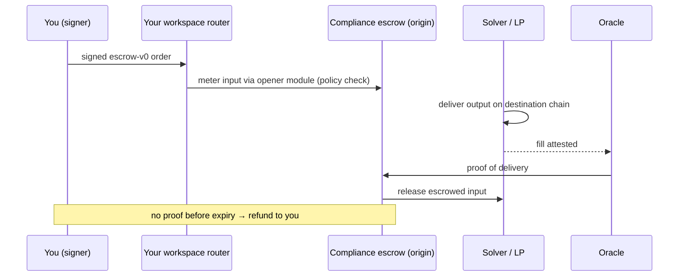

Every workspace on TetraFi gets its **own on-chain router** - an immutable contract deployed for you, owned by you. Trades enter through your router, flow through shared immutable venue modules, and settle delivery-versus-payment through a compliance-gated escrow: the counterparty delivers, or your funds are refunded. TetraFi holds no custody key and no upgrade key - anywhere in the stack.

## The Contract Stack

|                        | Role                                                                            |
| ---------------------- | ------------------------------------------------------------------------------- |
| **Workspace router**   | Your institution's entry point - one immutable contract per workspace, deployed automatically at provisioning. Pulls trade inputs transiently, meters them into modules, and forwards fills to the end recipient. |
| **Venue modules**      | Shared immutable modules the router dispatches to - escrow opening, swaps, bridge legs, FX continuations. New capabilities are *added* to the allowlist; existing modules can never be swapped out from under you. |
| **Compliance escrow**  | The settlement entry (`ComplianceSettlerEscrow`). Locks inputs under the signed order, enforces the compliance policy at deposit time, releases on proof of delivery, refunds on expiry. Its output-side twin gates fills on the destination chain. |
| **Settlement oracle**  | Attests destination-chain delivery back to the origin escrow so funds release only against proof. |

<Danger>
  Never send funds directly to a settlement address. Value moves only through a signed order's flow - the quote response and preflight `nextActions` tell you exactly what to sign and where funds travel.
</Danger>

### Your Deployment, Your Addresses

Your workspace router's address is deterministic and predicted before deployment - it is provisioned automatically when your workspace is created, and it belongs to your workspace permanently. Module and escrow addresses vary by chain and version. Never hardcode any of them: the addresses carried in quote responses and preflight plans are authoritative for every trade. See [Supported Chains](/supported-chains) for network coverage.

## Settlement Lifecycle

When you request a quote, TetraFi returns an [EIP-712](/core-concepts/execution-modes) typed order payload (`escrow-v0`) representing the exact trade terms - assets, amounts, receiver, and expiry. You sign it; your router meters the input into escrow under those signed terms; and funds release to the counterparty only against proof that your output was delivered.

If delivery cannot be proven before the order expires, the escrow refunds you - and the refund path is **permissionless and cannot be paused**, by anyone. No partial state, no stuck funds, no custody.

## Funding Locks

How your input funds enter escrow depends on the lock type available for the corridor and token:

| Lock type     | Description                                                          | Requires            |
| ------------- | -------------------------------------------------------------------- | ------------------- |
| Permit2       | Escrow pull authorized inside the signed message (no separate tx)    | One-time Permit2 approval |
| EIP-3009      | `transferWithAuthorization` for tokens that support it (e.g. USDC)   | No prior approval   |
| Resource lock | Pre-positioned balance drawn per order                               | Prior deposit       |

The preflight `nextActions` select the lock for you - see [Token Approvals](/core-concepts/token-approvals) for the check-and-approve flow.

## Signed Payloads

Each quote carries its complete typed payload - domain, types, and message - in the `order` field:

| Order type  | What you sign                                                        |
| ----------- | -------------------------------------------------------------------- |
| `escrow-v0` | The `StandardOrder` typed data returned verbatim in `quote.order`    |

Sign exactly what the quote returns. The `integrityChecksum` binds your submission to the quote you were shown, so any mutation of the payload is rejected at submission.

See the [RFQ Order Submission guide](/rfq-api/guides/gasless-execution) and the [Router API quickstart](/router-api/quickstart) for the full signing flows.
