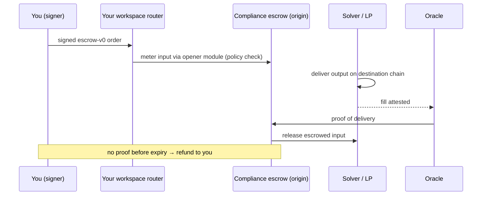

Every workspace gets its **own on-chain router**: an immutable contract deployed for you, owned by you. Trades enter through it, flow through shared immutable venue modules, and settle delivery-versus-payment through a compliance-gated escrow: the counterparty delivers, or you are refunded. TetraFi holds no custody key and no upgrade key anywhere in the stack.

## The Contract Stack

|                        | Role                                                                            |
| ---------------------- | ------------------------------------------------------------------------------- |
| **Workspace router**   | One immutable contract per workspace. Pulls inputs transiently, meters them into modules, forwards fills to the recipient. |
| **Venue modules**      | Shared immutable modules: escrow opening, swaps, bridge legs, FX continuations. Capabilities are *added* to the allowlist, never swapped out. |
| **Compliance escrow**  | `ComplianceSettlerEscrow`. Locks inputs under the signed order, enforces the policy at deposit, releases on proof of delivery, refunds on expiry. Its output-side twin gates fills on the destination chain. |
| **Settlement oracle**  | Attests destination-chain delivery back to the origin escrow, so funds release only against proof. |

<Danger>
  Never send funds directly to a settlement address. Value moves only through a signed order's flow; preflight `nextActions` say what to sign and where funds travel.
</Danger>

Your router's address is deterministic, predicted before deployment, and yours permanently. Module and escrow addresses vary by chain and version. Never hardcode any of them: the addresses in quote responses and preflight plans are authoritative.

## Settlement Lifecycle

Every quote carries its own [EIP-712](/core-concepts/execution-modes) `escrow-v0` payload. Your signature authorizes it, your router locks the input into escrow on those terms, and only a delivery proof moves the funds onward.

If the expiry passes without a delivery proof, the escrow refunds your input through a path that is **permissionless and unpausable**. There is never a half-settled state.

## Where the Next Layers Plug In

<Note>
  **Coming soon.** [Multilateral Netting](/netting) and the [Shared Collateral Network](/collateral) are in design.
</Note>

A settlement opted into clearing posts an **obligation**, and only the net residual later takes the escrow path above. A vault **draw** funds a fill or settlement leg through the same opener and escrow, whose release repays the vault. Integration shapes: [netting](/netting-api/introduction), [shared collateral](/collateral-api/introduction).

## Rolling Out on the Rails

* **Bonded firm quotes** - a proven no-show refunds you; the bond is slashed only on positive evidence
* **A governed compliance plane** - a delayed main lane and an instant emergency lane
* **Per-corridor settlement oracles**
* **An add-only module catalogue** - a refund is bound to the version that opened the trade
* **The same escrow model on Solana and Tron**

## Funding Locks

Preflight selects the lock for the corridor and token; [Token Approvals](/core-concepts/token-approvals) covers the check-and-approve flow.

| Lock type     | Description                                                          | Requires            |
| ------------- | -------------------------------------------------------------------- | ------------------- |
| Permit2       | The signature carries the pull authorization; no extra transaction   | One-time Permit2 approval |
| EIP-3009      | `transferWithAuthorization` for tokens that support it (e.g. USDC)   | No prior approval   |
| Resource lock | Pre-positioned balance drawn per order                               | Prior deposit       |

## Signed Payloads

Each quote carries its complete typed payload in `quote.order`: for `escrow-v0`, the `StandardOrder` typed data. Sign exactly what the quote returns; the `integrityChecksum` binds your submission to the quote shown, so any mutation is rejected. Signing flows: [RFQ Order Submission guide](/rfq-api/guides/gasless-execution), [Router API quickstart](/router-api/quickstart).
