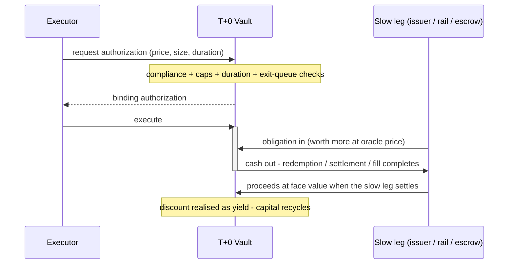

<Note>
  **Coming soon.** This page describes the planned mechanism. Contract addresses, parameters, and audits publish at launch; unresolved economics are marked as such rather than guessed.
</Note>

## An Exchange, Not a Loan

Most instant-liquidity designs lend capital and hope repayment arrives. A T+0 Vault never does: its cash leaves **only inside a transaction where an obligation valued higher at oracle price arrives in exchange** - a tokenised asset already queued for redemption, a settlement receivable on TetraFi's T+1 rail, a claim on funds an escrow already holds.

That inversion carries the whole risk story. The vault's net asset value doesn't dip when capital deploys - one asset (cash) is swapped for another (an obligation bought at a discount). When the obligation matures at face value, the discount is realised as depositor yield. Fronting a multi-day redemption means *holding that obligation to maturity* - not trusting a borrower.

## The Flow

<Steps>
  <Step title="A settlement gap appears">
    A holder wants out of a tokenised asset mid-queue, an OTC trade needs T+0 settlement against a T+1 counterparty, a solver needs destination-chain liquidity for a cross-chain fill.
  </Step>

  <Step title="An executor quotes the wait">
    A market maker or solver prices the duration - how long until the slow leg completes - and requests a binding authorization from the vault. Every gate fires here: compliance policy, per-executor caps, duration limits, and the exit queue's seniority.
  </Step>

  <Step title="The vault exchanges, atomically">
    In one transaction the obligation transfers into the vault and cash goes out at the authorized, oracle-bounded price. The vault itself performs the exchange - the executor only instructs it, and at no point holds vault capital.
  </Step>

  <Step title="The slow leg completes, capital recycles">
    The redemption pays out, the receivable settles, the escrow releases - proceeds land in the vault at face value, the obligation retires, and the capital is immediately available for the next draw. Recycling is what makes a modest vault serve deep flow.
  </Step>
</Steps>

## Why Zero-Collateral Is Safe Here

No executor posts collateral, yet depositors are not extending unsecured credit. The protections stack:

1. **Obligation before liquidity.** There is no moment where cash is out and the obligation is not in - the exchange is one transaction or it doesn't happen.
2. **The vault executes.** Executors instruct draws but never custody capital; no code path hands vault cash to an executor's address.
3. **Oracle-bounded pricing.** Every purchase clears at or below oracle value minus a curator-set minimum discount - the vault can overpay only if the oracle itself is wrong, and concentration caps bound even that.
4. **Withdrawals outrank draws.** Cash already promised to the exit queue can never be consumed by a new purchase.
5. **Duration caps match exit windows.** No obligation may outlive the vault's withdrawal delay, so exiting depositors and maturing obligations never race each other.
6. **Losses are shared instantly.** If an obligation ever impairs, the markdown hits all shares pro-rata the moment it's recognised - no first-out advantage, no reason to run.
7. **Everyone is gated.** Curators, depositors, and executors pass KYB, sanctions, and jurisdiction checks per the vault's policy - and every draw re-checks it.
8. **Caps and circuit breakers.** Per-executor and per-asset limits bound any single exposure; irregular settlement behaviour halts a lane automatically while existing obligations run to maturity.

<Note>
  **What's deliberately not stated yet:** fee splits, specific oracle providers, and idle-capital yield strategies are open design decisions - they'll be published as parameters, not promises.
</Note>

## Keep Going

<CardGroup cols={2}>
  <Card title="Participants" icon="users" href="/vaults/participants">
    Who curates, who deposits, who executes - and what each earns.
  </Card>

  <Card title="Use Cases" icon="layer-group" href="/vaults/use-cases">
    The four settlement gaps the first vaults are built to close.
  </Card>
</CardGroup>
